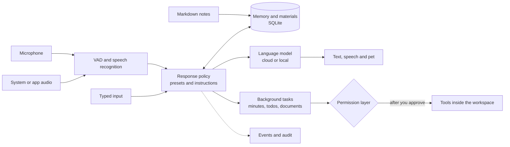

<div align="center">


# GreatSage

**A Windows desktop secretary that listens, remembers and acts only with your approval**

It hears what you say and can also listen in on meeting audio from your computer. It remembers facts across sessions and turns meetings and notes into minutes, todos and documents with sources. Anything with side effects waits for your approval.

[](https://github.com/MuzeAnisichael/GreatSage/actions/workflows/ci.yml)
[](LICENSE)


[Quick start](#quick-start) · [Usage (Chinese)](docs/usage.md) · [Project status (Chinese)](docs/project-status.md) · [Roadmap (Chinese)](docs/roadmap.md) · [Changelog](CHANGELOG.md)

[简体中文](README.md) · English

</div>

<picture>
  <source media="(prefers-color-scheme: dark)" srcset="docs/assets/console-dark.webp">
  
</picture>

> [!NOTE]
> GreatSage is an **alpha**. It is developed on Windows 11 with Python 3.11 and runs from source; there is no installer yet.
>
> - **Versions:** the latest release is 0.2.0-alpha.1. The v0.3 materials library, minutes tasks and controlled tools are merged into main but not released.
> - **Language:** the interface and the detailed docs are in Simplified Chinese. Replies can be in Chinese, English or Japanese.
> - **Screenshots:** made with fictional data and a local demo model.

## What it does

- **Listens and decides when to speak**
  - Captures the microphone plus one desktop source: all system audio, or a single app.
  - Three presets (conversation partner, listening assistant, proactive secretary) and your own global instructions decide whether it answers, explains, reminds or stays quiet.
- **Remembers across sessions**
  - Transcripts, explicit memories and three levels of summaries all keep their sources. Search is keyword-based, with optional semantic search.
  - Correcting or deleting a transcript also invalidates the summaries, memories and answers derived from it.
- **Writes minutes with sources (v0.3)**
  - Import `.md` notes, then turn a meeting and those notes into minutes, editable todos and a document draft.
  - Every item cites its sources as `[S1]`-style markers; items it cannot source are labeled.
- **Asks before acting (v0.3)**
  - Writing, opening and deleting need a click in the console by default. Writes and deletes can be undone, and the command tool is off by default.
  - Overheard audio and imported notes can never start an action.
- **Cloud or local models**
  - Speech recognition, the language model and speech synthesis are configured separately. You can mix OpenRouter, OpenAI-compatible APIs, Ollama and local engines.
- **Auditable**
  - Every interaction has a trace ID with the sources actually used, Skill versions, stage timings and the usage reported by each service.
  - Request snapshots keep metadata only unless you opt in.
- **Desktop pet**
  - A chibi owl shows its status, simplified task progress and pending approvals. You can pat it.

## Screenshots

<table>
  <tr>
    <td width="50%"><br><sub><b>Tasks and outputs</b>: each step of a minutes task shows its status and timing. Operations with side effects wait here for approval.</sub></td>
    <td width="50%"><br><sub><b>Minutes with sources</b>: each marker in the text links to a source excerpt you can check.</sub></td>
  </tr>
  <tr>
    <td width="50%"><br><sub><b>Tools and permissions</b>: deny beats ask, ask beats allow. Delete and command tools can never be always-allowed.</sub></td>
    <td width="50%"><br><sub><b>Long-term memory</b>: explicit memories and transcripts persist across sessions and can be corrected or deleted.</sub></td>
  </tr>
</table>

<p align="center">
  <br>
  <sub>The pet shows short prompts; details stay in the console.</sub>
</p>

## Quick start

You need Windows, Python 3.11 and Node.js/npm. This API-first setup does not download large speech models:

```powershell
python -m venv .venv
.\.venv\Scripts\python.exe -m pip install -e ".[dev]"
npm.cmd ci
npm.cmd start
```

For local speech recognition or Windows system voices, add the optional dependencies:

```powershell
.\.venv\Scripts\python.exe -m pip install -e ".[local]"
```

After it starts:

1. In Settings, choose the speech recognition, language model and speech synthesis services, save them and test each connection.
2. Go back to the conversation page, pick your audio sources and start listening.

Listening, spoken replies and recording are all off on first launch.

- **API keys:** read from environment variables, or entered in Settings and encrypted with Windows DPAPI. Keys are never shown again. `.env.example` only documents variable names; `.env` is not loaded automatically.
- **Local models:** local recognition models must be prepared explicitly in Settings. Starting to listen only loads models already in the cache.

### Build a local folder package

```powershell
.\.venv\Scripts\python.exe -m pip install -e ".[build,local]"
npm.cmd run package
```

This produces `release/win-unpacked/GreatSage.exe`; keep every file in that folder. It is an unsigned Windows x64 folder build, not an installer. Set `GREATSAGE_DATA_DIR` to use a separate data directory.

## How it works



Electron runs the windows, pet and tray. The Python backend listens only on 127.0.0.1 and handles audio, models, memory, tasks and events. Desktop audio is stored as overheard content; only your typed text, microphone requests and console actions can start a tool call.

## Data and privacy

| Data | Default |
| --- | --- |
| Transcripts, chats, summaries, explicit memories | Kept until you delete them |
| Imported notes, minutes and documents (v0.3) | Kept until you delete them; citations to deleted or changed sources are invalidated |
| Detailed audit events, request snapshots | 30 days, configurable; snapshots store metadata only by default |
| Raw recordings | Off by default; kept 7 days when enabled |
| API keys | Environment variables or DPAPI-encrypted for the current Windows user |

When you run from source, runtime data lives in `.runtime/` and never enters version control. Cloud services receive the audio, context or text they process; deleting data locally does not recall what a service already received.

## Known limitations

- **Speech recognition:** audio is segmented and recognized by repeated snapshots, not a native streaming API. In three runs of the full API voice pipeline:
  - Median time to first text was about 3.14 s, and to audio ready about 4.90 s.
  - The targets of 1–2 s to first text and 2–3 s to playback are not met yet.
- **Echo:** echo handling combines process exclusion, playback references and text de-duplication. It is not full acoustic echo cancellation; headphones help.
- **Model output:** listening decisions, conflict suggestions, summaries and minutes can be wrong. Original transcripts are always kept, so check names, numbers and dates.
- **v0.3 validation:** minutes were evaluated on fictional meetings only. Opening files and running commands have unit tests only. Voice-approval misrecognition has not been measured.
- **Distribution:** only a locally verified folder build exists. There is no installer, code signing or cross-machine testing yet.

Measurements and samples are in [v0.2 validation](docs/validation-v0.2.md) and [v0.3 validation](docs/validation-v0.3.md) (Chinese).

## Roadmap

| Stage | Status | Scope |
| --- | --- | --- |
| v0.1 alpha | Released | Voice secretary basics: presets, cloud/local models, memory, logs and the pet |
| v0.2 alpha | Released | Response-quality evaluation, hybrid search, layered summaries, request audits and background recovery |
| v0.3 | Merged, unreleased | Materials library, cited minutes/todos/documents, controlled tools, task cancel and resume; installer and MCP pending |
| v0.4 and later | Planned | Screen and window input, more platforms, richer pet |

## Contributing

Issues and pull requests are welcome. Please read [CONTRIBUTING.md](CONTRIBUTING.md) first:

- Tests use fictional data only.
- Never commit runtime data, recordings, transcripts or credentials.
- Behavior changes come with updated docs and recorded test results.

Report security issues privately as described in [SECURITY.md](SECURITY.md).

## License and name

GreatSage is released under the [MIT License](LICENSE). The name pays tribute to the "Great Sage" skill in *That Time I Got Reincarnated as a Slime*. The interface and the owl mascot are original designs.
