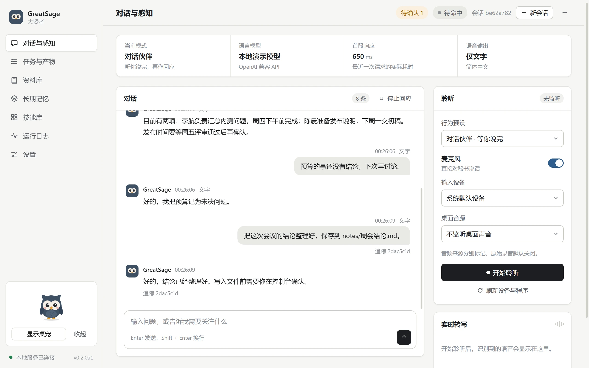
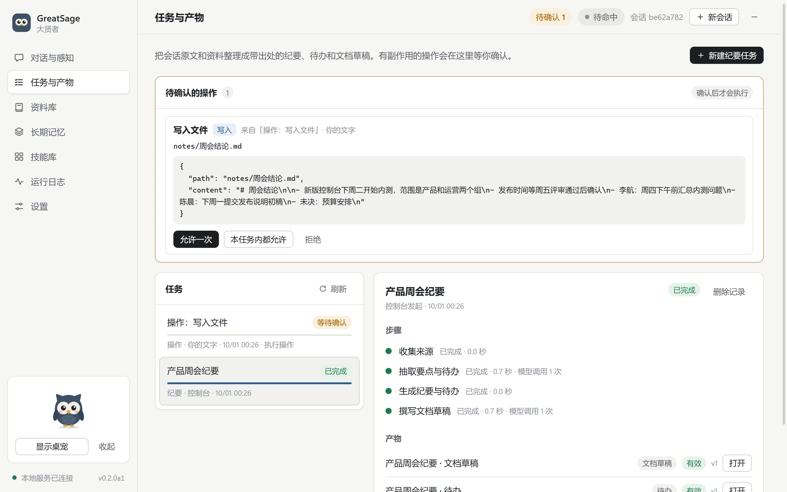
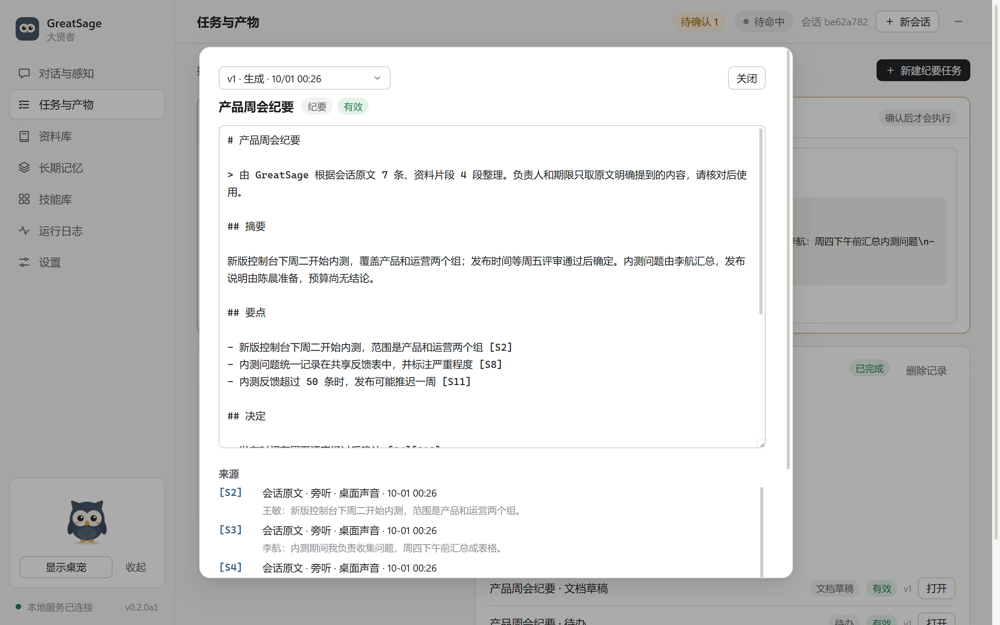
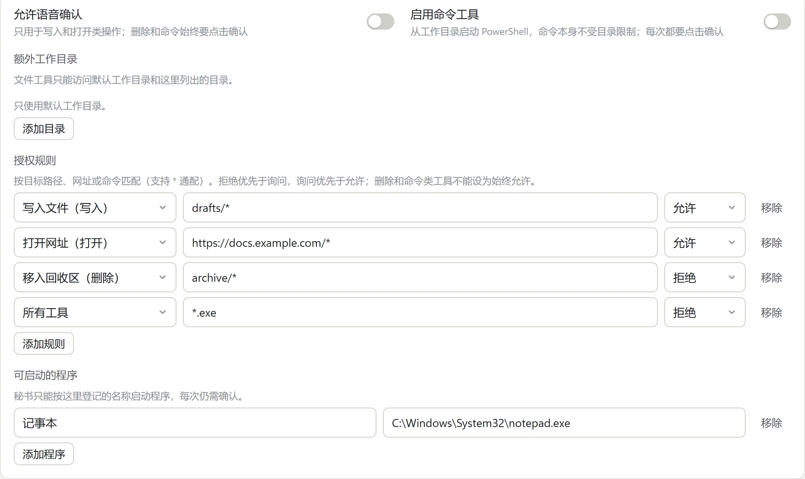
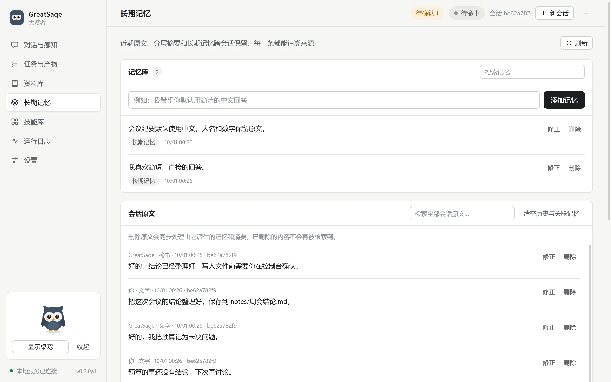
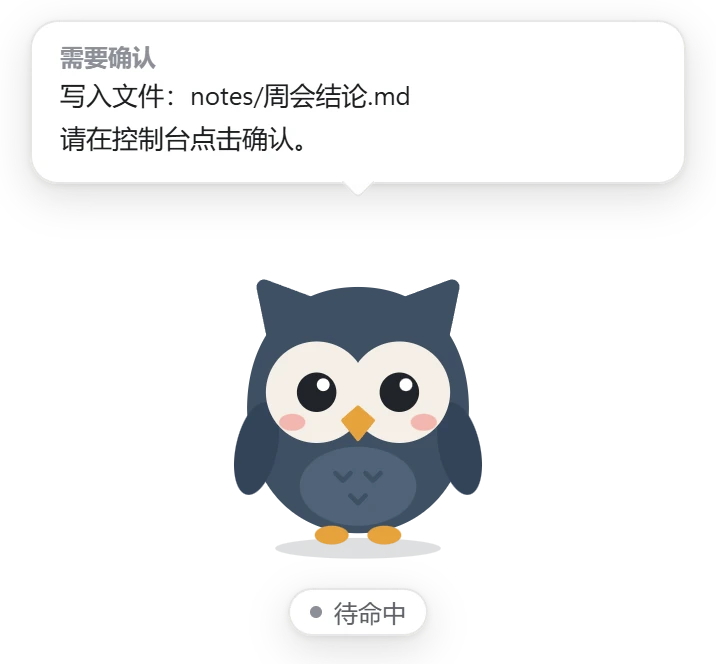
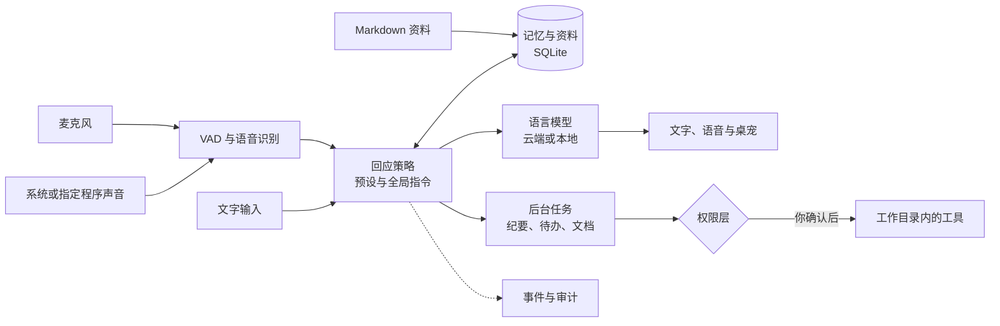

<div align="center">


# GreatSage · 大贤者

**会听、会记、会动手的 Windows 桌面秘书**

听你说话，也能旁听电脑里的会议声音；跨会话记住事实，把会议和资料整理成带出处的纪要、待办和文档。有副作用的操作，先等你确认。

[](https://github.com/MuzeAnisichael/GreatSage/actions/workflows/ci.yml)
[](LICENSE)


[快速开始](#快速开始) · [使用说明](docs/usage.md) · [项目现状](docs/project-status.md) · [路线图](docs/roadmap.md) · [变更记录](CHANGELOG.md)

简体中文 · [English](README.en.md)

</div>

<picture>
  <source media="(prefers-color-scheme: dark)" srcset="docs/assets/console-dark.webp">
  
</picture>

> [!NOTE]
> 项目处于 **alpha** 阶段，以 Windows 11 和 Python 3.11 为开发基准，目前需要从源码运行，还没有安装包。
>
> - **版本**：最近发布的是 0.2.0-alpha.1。v0.3 的资料库、纪要任务和受控工具已合入 main，尚未发版。
> - **截图**：使用虚构数据和本地演示模型生成。
> - **进度**：已实现和已验证的内容见[项目现状](docs/project-status.md)。

## 它能做什么

- **听与判断**
  - 麦克风和一个桌面音源同时监听，桌面音源可以是系统整体声音，或一个指定程序。
  - 有对话伙伴、旁听助手、主动秘书三种预设，结合你写的全局指令，决定回答、解释、提醒还是保持安静。
- **跨会话记忆**
  - 原文、显式记忆和三层摘要都保留来源，支持关键词检索和可选的语义检索。
  - 修正或删除原文时，由它派生的摘要、记忆和回答会一起失效。
- **带出处的纪要（v0.3）**
  - 可以导入 `.md` 资料，把会议原文和资料整理成纪要、可编辑的待办和文档草稿。
  - 每条内容都标出 `[S1]` 这样的来源；找不到来源的条目会明确标出来。
- **操作先确认（v0.3）**
  - 写入、打开和删除默认要你在控制台点击确认，写入和删除可以撤销；命令工具默认关闭。
  - 旁听到的内容和导入的资料不能发起操作。
- **云端或本地模型**
  - 语音识别、语言模型和语音合成可以分别配置，混用 OpenRouter、OpenAI 兼容接口、Ollama 和本地方案。
- **可以审计**
  - 每次交互都有 trace ID，记录实际使用的来源、Skill 版本、各阶段耗时和服务返回的用量。
  - 请求快照默认只保存元数据。
- **桌宠**
  - Q 版猫头鹰显示运行状态、简化的任务进度和待确认提示，也可以摸摸它。

## 界面一览

<table>
  <tr>
    <td width="50%"><br><sub><b>任务与产物</b>：纪要任务的每一步都有状态和耗时；有副作用的操作停在这里等你确认。</sub></td>
    <td width="50%"><br><sub><b>带出处的纪要</b>：正文里的来源标记对应下方的原文摘录，可以逐条核对。</sub></td>
  </tr>
  <tr>
    <td width="50%"><br><sub><b>工具与授权</b>：拒绝优先于询问，询问优先于允许；删除和命令不能设为始终允许。</sub></td>
    <td width="50%"><br><sub><b>长期记忆</b>：显式记忆和原文跨会话保留，可以修正或删除。</sub></td>
  </tr>
</table>

<p align="center">
  <br>
  <sub>桌宠气泡只显示简化提示，详细内容在控制台。</sub>
</p>

## 快速开始

需要 Windows、Python 3.11 和 Node.js/npm。以下是 API 优先的开发安装方式，不会下载大型语音模型：

```powershell
python -m venv .venv
.\.venv\Scripts\python.exe -m pip install -e ".[dev]"
npm.cmd ci
npm.cmd start
```

使用本地语音识别或 Windows 系统语音时，补充可选依赖：

```powershell
.\.venv\Scripts\python.exe -m pip install -e ".[local]"
```

启动后：

1. 在“设置”中分别选择语音识别、语言模型和语音合成服务，保存后测试连接。
2. 回到“对话与感知”，选择音源并开始聆听。

首次启动默认不开启监听、语音播报和录音保存。

- **API 密钥**：可以使用已有的环境变量，也可以在设置中输入，由 Windows DPAPI 加密保存；界面不会回显密钥。`.env.example` 只是变量说明，程序不会自动加载 `.env`。
- **本地模型**：本地识别模型要在设置里明确准备，开始聆听只会加载已有缓存。Ollama 的安装、模型下载和服务启动由你自己管理。
- **依赖脚本：**`scripts/setup.ps1` 可以一次装好开发和本地语音依赖。

各服务的配置见[服务说明](docs/providers.md)。

### 构建本机目录包

```powershell
.\.venv\Scripts\python.exe -m pip install -e ".[build,local]"
npm.cmd run package
```

构建结果是 `release/win-unpacked/GreatSage.exe`，要保留同目录的全部文件。它是 Windows x64 目录包，还没有安装器和发行签名。可以用环境变量 `GREATSAGE_DATA_DIR` 指定独立的数据目录。

## 工作方式



Electron 管理窗口、桌宠和托盘；Python 后端只监听 127.0.0.1，负责音频、模型、记忆、任务和事件。桌面音频按旁听内容保存，只有你的文字、麦克风请求和控制台操作才能发起工具调用。模块和数据流见[实现架构](docs/architecture.md)。

## 数据与隐私

| 数据 | 默认策略 |
| --- | --- |
| 转写、对话、摘要、显式记忆 | 保留到你删除 |
| 导入的资料、纪要与文档（v0.3） | 保留到你删除；来源删除或修改后，对应引用失效 |
| 详细审计事件、请求快照 | 保留 30 天，可以配置；快照默认只存元数据 |
| 原始录音 | 默认不保存；开启后保留 7 天，可以配置 |
| API 密钥 | 环境变量，或当前 Windows 用户的 DPAPI 密文 |

源码启动的运行数据保存在项目的 `.runtime/` 目录，不进入版本管理。使用云端服务时，相应的音频、上下文或文本会发给你配置的服务；在本地删除，不代表服务端的数据也被撤回。删除范围见[记忆与删除设计](docs/memory-design.md)。

## 已知限制

- **语音识别**：对语音分段并反复识别快照，不是原生流式识别。完整 API 语音链路的三轮测试中：
  - 首字 P50 约 3.14 秒，音频就绪约 4.90 秒。
  - 原定首字 1–2 秒、语音起播 2–3 秒的目标还没有达到。
- **自身回声**：用进程排除、播放参考和文本去重来减少，不是完整的声学回声消除（AEC）。用耳机代替扬声器可以减少回声干扰。
- **模型判断**：语义判断、冲突建议、摘要和纪要都可能出错。原文始终保留，请核对姓名、数字和期限。
- **v0.3 验证范围**：纪要只用虚构会议评测过；打开文件和执行命令只做过单元测试；语音确认的误识别率还没有测。
- **分发**：只有本机验证过的目录包，还没有安装器、发行签名和跨电脑验证。

测量方法和样本见 [v0.2 验证](docs/validation-v0.2.md)和 [v0.3 验证](docs/validation-v0.3.md)。

## 路线图

| 阶段 | 状态 | 内容 |
| --- | --- | --- |
| v0.1 alpha | 已发布 | 语音秘书基础：三种预设、云端／本地模型、记忆、日志和桌宠 |
| v0.2 alpha | 已发布 | 回应质量评测、混合检索、分层摘要、请求审计与后台恢复 |
| v0.3 | 已合入 main，未发版 | 资料库、带出处的纪要／待办／文档、受控工具、任务取消与恢复；安装器和 MCP 待实现 |
| v0.4 及以后 | 规划中 | 屏幕和窗口等更多电脑信息输入，更多平台和桌宠表现 |

详细计划见[路线图](docs/roadmap.md)。版本号表示开发顺序，不承诺日期。

## 文档

| 文档 | 内容 |
| --- | --- |
| [项目现状](docs/project-status.md) | 已实现、已验证、仍待验收和未来目标的快速索引 |
| [使用说明](docs/usage.md) | 音源、预设、记忆、资料、任务和工具授权的操作方法 |
| [需求与验收](docs/requirements.md) | 已确认的范围、实现状态和尚待完成的验收 |
| [实现架构](docs/architecture.md) | 模块、实时管线、事件、接口与数据边界 |
| [记忆与删除设计](docs/memory-design.md) | 数据结构、检索、上下文预算、修正和删除语义 |
| [服务配置](docs/providers.md) | 已验证的本地／云端模型、音色与代理行为 |
| [可重复评测](docs/evaluation.md) | 离线和真实服务评测的命令与口径 |
| [v0.3 验证](docs/validation-v0.3.md) · [v0.2 验证](docs/validation-v0.2.md) · [v0.1 验证](docs/validation.md) | 各版本的测试结果与已知限制 |
| [v0.3 方案](docs/v0.3-plan.md) · [v0.2 方案](docs/v0.2-plan.md) · [v0.1 方案](docs/v0.1-plan.md) | 各阶段确定的范围和验收约定 |
| [贡献与开发](docs/development.md) | 环境、验证、凭据、提交和发布流程 |

## 参与贡献

欢迎提交 Issue 和 Pull Request。开始之前请阅读[贡献指南](CONTRIBUTING.md)：

- 测试只使用虚构数据。
- 不要提交运行数据、录音、转写或凭据。
- 行为变化要同步更新文档和验证记录。

发现安全问题请按[安全策略](SECURITY.md)私下报告，不要公开提交。

## 许可证与名称

代码以 [MIT 许可证](LICENSE)发布。

名称致敬《关于我转生变成史莱姆这档事》中的“大贤者（Great Sage）”能力（[名称参考](https://www.crunchyroll.com/news/features/2019/5/3/explore-rimurus-growth-in-this-official-skill-tree)）。界面和猫头鹰桌宠是本项目自己的设计。
