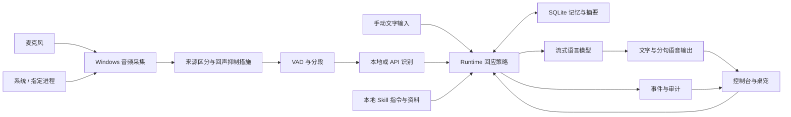

# GreatSage v0.1 alpha 实现架构

更新日期：2026-09-04。本文记录已经落地的模块与明确限制；性能和真实服务兼容性须单独验证。

## 1. 组成与调用关系

Electron 管理主窗口、桌宠、托盘和本地服务生命周期；Python 服务管理音频、模型、记忆和事件。两者通过回环 HTTP 与 WebSocket 通信。采集线程不等待 ASR 或 LLM 网络请求。

| 文件／目录 | 责任 |
| --- | --- |
| desktop/main.cjs、preload.cjs | 窗口、托盘、受限桌面接口、本地后端启动与连接凭据 |
| ui/ | 控制台、桌宠、语音播放、状态和日志展示 |
| greatsage/server.py | 有认证的本地 HTTP／WebSocket 接口与输入校验 |
| greatsage/runtime.py | 音频任务、行为预设、上下文、回复、播放与压缩调度 |
| greatsage/audio.py、winloopback.py | 麦克风、系统／进程回环、PCM 转换与线程队列 |
| greatsage/echo.py | 播放参考及自身声音抑制；不是完整 AEC |
| greatsage/segmentation.py | 30 ms VAD 帧、预留音频、临时快照、静音结束与最长分段 |
| greatsage/providers.py | 流式 LLM、ASR、TTS、本地模型准备与受控错误 |
| greatsage/settings.py | 配置校验、环境变量、DPAPI 密钥与原子提交 |
| greatsage/memory.py | 持久化、检索、摘要、来源关系、修正与删除 |
| greatsage/skills.py | 只读技能注册、选择、版本与引用边界 |

## 2. 音频与实时响应

每个音源保留来源标记，转换为单声道 16 kHz PCM16，进入有界队列。用户选择麦克风和至多一个桌面音源；指定程序模式包括该程序的进程树。设备或进程重新启动后，应刷新并重新选择当前 ID。

VAD 在独立于模型请求的管线中处理音频，产生开始、临时快照、最终片段和丢弃事件。临时快照可反复请求 ASR，最终片段串行保序；长语句达到上限后分段，并保持“仍在说话”的状态。这是**分段快照识别**，不是语音 API 的原生流式协议。

麦克风开始说话时可取消回复和播放。采集启停、会话切换与数据删除使用代际标记：旧回调、旧队列项与迟到的 ASR 结果会被拒绝。删除另有数据代际，用于阻止旧回答正文再次写入或广播；普通用户打断仍保留已显示的部分回答。

自身声音处理组合使用进程排除、播放参考与桌面音源文本去重。麦克风仅采用保守的声学抑制，不按转写文字相似度判定回声，以保留用户复述、确认或纠正助手回答的机会。不同播放格式、扬声器声学路径、噪声和重叠发言会影响效果；该机制不是完整自适应声学回声消除，仍需要针对本机的真实语音验证。

## 3. 预设与输入边界

- 手动文字是直接请求；麦克风在对话预设中直接触发回应。
- 旁听预设使用明确提问／叫名／请求词规则，未触发时保留原文并进行后台记忆处理。
- 主动预设同时要求允许主动回应，并经过冷却时间、前台忙闲和模型相关性判断。
- 模型返回 `[SILENT]` 时保持安静；该标记即使跨流式片段返回也不进入文字或语音输出。
- 桌面音频是 observation。全局指令、Skill 方法、历史和观察数据的优先关系由系统提示明确区分。
- 所有预设都不创建定时提醒，也不拥有电脑操作或工具执行能力。

当前判断包含启发式规则和模型输出，不能保证每次提问识别与主动插话都合适。后续应使用真实会话样本评估误触发与漏触发。

## 4. 模型适配与输出

ASR、LLM、TTS 分别选择服务与凭据，可以组成全 API、本地或混合链路。默认配置是起点，不代表提供商一定支持某个模型的全部能力；语音识别、语言模型和语音合成要分别验证。

本地 ASR 的准备操作允许下载模型；开始聆听只加载已缓存模型。Ollama 是独立运行服务。模型下载、初始化和预热不计为已经完成语音质量或实时性验收。

LLM 内容逐段送往界面，适合朗读的片段进入语音队列。TTS 失败会记录错误并继续保留文字回答；语言设置不同时可增加一次语音文本翻译调用。音频生成与客户端实际起播分别记录，打断会停止播放并清理待播缓存。

## 5. 上下文与后台工作

近期原文、显式记忆、历史检索、摘要和 Skill 内容在预算内组合。最终 messages JSON 的 UTF-8 字节数包含格式与主动前缀，同时为输出预留容量；这是一种保守估算，不是模型专属 tokenizer。

压缩与正常回答使用同一提供商适配接口，但后台压缩让出前台交互。保存摘要前重新验证来源。具体结构和删除规则见 [memory-design.md](memory-design.md)。

## 6. 事件与可审计性

每次交互的 trace ID 连接输入、行为决策、上下文、模型调用、文字输出与播放。持久事件保留来源 ID、配置哈希、Skill／资源版本、模型信息、用量和各阶段耗时；临时转写和逐字 delta 主要用于实时显示，稳定原文与最终回答进入历史。

常见事件包括：

| 事件 | 用途 |
| --- | --- |
| transcript、speech_start | 临时／最终识别与语音开始 |
| user_message、observation_message | 稳定用户输入或旁听内容 |
| decision | 回应、观察或延后及可检查的原因 |
| context、usage、metrics | 实际来源、版本、用量和阶段时延 |
| response_start/delta/done | 文字流与完成／中断状态 |
| audio、playback、interrupt | 语音就绪、播放回执与打断 |
| compression_start/done、memory_updated | 压缩来源与数据变化 |
| stream_reset | 慢客户端丢失连续事件后明确要求重载状态 |
| error | 服务或管线异常及可用的降级信息 |

慢订阅者优先丢弃普通日志事件，不能维持完整文字流时发送显式重载标记，避免界面误认为缺段内容完整。审计记录系统实际输入和结果，不声称能读取模型内部思维链。

当前哈希及来源追踪不等同于完整不可变请求归档。外部 Skill 和历史配置被修改后，未必能精确重放旧请求；完整受控快照与导出列为后续增强。

## 7. 配置、凭据与本地接口

配置更新先验证完整合并结果，再写入原子快照。UI 输入的密钥由当前 Windows 用户 DPAPI 加密到独立版本文件，settings.json 的原子替换是提交点。公开配置只含 key_configured；provider 调用阶段才取得明文。

环境变量先查询当前进程；Windows 上缺失时只查询用户注册表中的指定变量名。手动保存的密钥优先于环境变量，清除本地覆盖值后恢复环境变量。非 Windows 不静默退回明文密钥文件。

服务仅监听 127.0.0.1。HTTP API 使用本地随机 Bearer 凭据，WebSocket 验证连接凭据和来源；Electron 不向普通网页开放任意 Node.js 或 shell 接口。首版没有远程多用户服务模式。

## 8. 扩展点与尚未完成的能力

提供商适配、音源、回应调度、记忆和桌宠分别分层，便于后续新增服务、工具与其他输入。v0.1 尚未实现原生流式 ASR、完整 AEC、语义向量检索、任意电脑操作和跨平台桌面采集；有独立安装包构建配置，但不能据此宣称已经交付稳定安装包。
