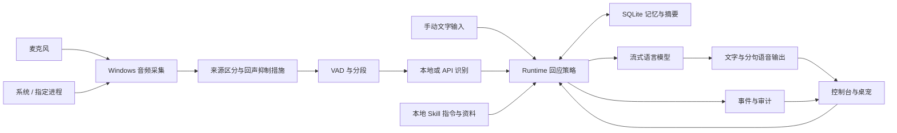

# GreatSage v0.2 alpha 实现架构

更新日期：2026-09-27。本文记录已经落地的模块与明确限制；性能和真实服务兼容性见版本验证记录。

## 1. 组成与调用关系

```mermaid
flowchart LR
    Mic[麦克风] --> Capture[Windows 音频采集]
    Desktop[系统 / 指定进程] --> Capture
    Capture --> Echo[来源区分与回声抑制措施]
    Echo --> VAD[VAD 与分段]
    VAD --> ASR[本地或 API 识别]
    Text[手动文字输入] --> Runtime[Runtime 回应策略]
    ASR --> Runtime
    Runtime <--> Memory[SQLite 记忆与摘要]
    Skills[本地 Skill 指令与资料] --> Runtime
    Runtime --> LLM[流式语言模型]
    LLM --> Output[文字与分句语音输出]
    Output --> UI[控制台与桌宠]
    UI --> Runtime
    Runtime --> Events[事件与审计]
    Events --> UI
```

Electron 管理主窗口、桌宠、托盘和本地服务生命周期；Python 服务管理音频、模型、记忆和事件。两者通过回环 HTTP 与 WebSocket 通信。采集线程不等待 ASR 或 LLM 网络请求。

| 文件／目录 | 责任 |
| --- | --- |
| desktop/main.cjs、preload.cjs | 窗口、托盘、受限桌面接口、本地后端启动与连接凭据 |
| ui/ | 控制台、桌宠、语音播放、状态和日志展示 |
| greatsage/server.py | 有认证的本地 HTTP／WebSocket 接口与输入校验 |
| greatsage/runtime.py | 音频任务、行为预设、上下文、回复、播放与压缩调度 |
| greatsage/audio.py、winloopback.py | 麦克风、系统／进程回环、PCM 转换与线程队列 |
| greatsage/echo.py | 播放参考及自身声音抑制；不是完整 AEC |
| greatsage/segmentation.py | 30 ms VAD 帧、预留音频、临时快照、静音结束与最长分段 |
| greatsage/providers.py | 流式 LLM、ASR、TTS、本地模型准备与受控错误 |
| greatsage/settings.py | 配置校验、环境变量、DPAPI 密钥与原子提交 |
| greatsage/memory.py | 持久化、检索、摘要、来源关系、修正与删除 |
| greatsage/skills.py | 只读技能注册、选择、版本与引用边界 |
| greatsage/semantic.py、budget.py | 版本化向量索引、混合检索与模型输入预算 |
| greatsage/decisions.py、background.py | 结构化回应策略、有限批次及失败退避 |
| greatsage/audit.py | 受控请求快照、凭据移除、导出与来源失效 |

## 2. 音频与实时响应

每个音源保留来源标记，转换为单声道 16 kHz PCM16，进入有界队列。用户选择麦克风和至多一个桌面音源；指定程序模式包括该程序的进程树。设备或进程重新启动后，应刷新并重新选择当前 ID。

VAD 在独立于模型请求的管线中处理音频，产生开始、临时快照、最终片段和丢弃事件。临时快照可反复请求 ASR，最终片段串行保序；长语句达到上限后分段，并保持“仍在说话”的状态。这是**分段快照识别**，不是语音 API 的原生流式协议。

每个 30 ms 帧都传入 VAD 更新内部状态，再应用 RMS 门限。音源带累计采样序号；丢帧会重置对应分段并拒绝此前进行中的 ASR 结果，避免拼接不连续话语。参考回声在长批次内按 20 ms 分别判断，保留独立人声帧。全部采集线程退出会回报 Runtime 并结束监听，旧代际通知不影响新采集。

麦克风开始说话时可取消回复和播放。采集启停、会话切换与数据删除使用代际标记：旧回调、旧队列项与迟到的 ASR 结果会被拒绝。删除另有数据代际，用于阻止旧回答正文再次写入或广播；普通用户打断仍保留已显示的部分回答。

自身声音处理组合使用进程排除、播放参考与桌面音源文本去重。麦克风仅采用保守的声学抑制，不按转写文字相似度判定回声，以保留用户复述、确认或纠正助手回答的机会。不同播放格式、扬声器声学路径、噪声和重叠发言会影响效果；该机制不是完整自适应声学回声消除，仍需要针对本机的真实语音验证。

## 3. 预设与输入边界

- 手动文字是直接请求；麦克风在对话预设中直接触发回应。
- 旁听明确叫名／请求走快速路径；含糊问题和转述结合短上下文与全局指令进行结构化 LLM 判断，最多 3 秒。失败保持安静，可关闭语义判断使用规则。
- 主动预设同时要求允许主动回应，并经过冷却时间、前台忙闲和模型相关性判断；5 分钟内标准化后完全相同的观察不重复触发。
- 模型返回 `[SILENT]` 时保持安静；该标记即使跨流式片段返回也不进入文字或语音输出。
- 桌面音频是 observation。全局指令、Skill 方法、历史和观察数据的优先关系由系统提示明确区分。
- 所有预设都不创建定时提醒，也不拥有电脑操作或工具执行能力。

当前判断包含启发式规则和模型输出，不能保证每次提问识别与主动插话都合适。后续应使用真实会话样本评估误触发与漏触发。

## 4. 模型适配与输出

ASR、LLM、TTS 分别选择服务与凭据，可以组成全 API、本地或混合链路。默认配置是起点，不代表提供商一定支持某个模型的全部能力；语音识别、语言模型和语音合成要分别验证。

本地 ASR 的准备操作允许下载模型；开始聆听只加载已缓存模型。Ollama 是独立运行服务。模型下载、初始化和预热不计为已经完成语音质量或实时性验收。

LLM 内容逐段送往界面，适合朗读的片段进入语音队列。TTS 失败会记录错误并继续保留文字回答；语言设置不同时可增加一次语音文本翻译调用。音频生成与客户端实际起播分别记录，打断会停止播放并清理待播缓存。

## 5. 上下文与后台工作

近期原文、有效显式记忆、历史检索、摘要和 Skill 内容在预算内组合。已准备且适用的 cl100k/o200k 编码计数包含消息封装估计；未知模型继续以 JSON UTF-8 字节上界预算。强制指令、主动前缀、输出容量与协议余量同时计入。

压缩与正常回答使用同一提供商适配接口，但后台压缩让出前台交互。保存摘要前重新验证来源。具体结构和删除规则见 [memory-design.md](memory-design.md)。

后台每轮至多压缩一个批次、索引 4 条记录；前台说话或最终识别/回复时让出资源。失败按 5–300 秒退避，界面可重试；重启根据 SQLite 未覆盖来源/未建索引记录继续，不重放旧回答。嵌入有独立开关与凭据，文本按 UTF-8 切块，索引按 provider/base URL/model/chunk version 隔离。前台嵌入和本地扫描共享等待上限；扫描分批检查截止时间，超时回退词法。

## 6. 事件与可审计性

每次交互的 trace ID 连接输入、行为决策、上下文、模型调用、文字输出与播放。持久事件保留来源 ID、配置哈希、Skill／资源版本、模型信息、用量和各阶段耗时；临时转写和逐字 delta 主要用于实时显示，稳定原文与最终回答进入历史。

常见事件包括：

| 事件 | 用途 |
| --- | --- |
| transcript、speech_start | 临时／最终识别与语音开始 |
| user_message、observation_message | 稳定用户输入或旁听内容 |
| decision | 回应、观察或延后及可检查的原因 |
| context、usage、metrics | 实际来源、版本、用量和阶段时延 |
| response_start/delta/done | 文字流与完成／中断状态 |
| audio、playback、interrupt | 语音就绪、播放回执与打断 |
| compression_start/done、memory_updated | 压缩来源与数据变化 |
| stream_reset | 慢客户端丢失连续事件后明确要求重载状态 |
| error | 服务或管线异常及可用的降级信息 |

慢订阅者优先丢弃普通日志事件，不能维持完整文字流时发送显式重载标记，避免界面误认为缺段内容完整。审计记录系统实际输入和结果，不声称能读取模型内部思维链。

语言模型调用保存不可变请求元数据；全文快照默认关闭。开启后存入实际 messages、配置和注入 Skill 文本，移除应用凭据，单条正文最多 256 KB，超出则仅留元数据。正文可以显式查看或导出。删除/修正来源会清理对应正文，日志保留期同时清理快照；启动时将中途请求标为 interrupted_restart。API/ASR/TTS 的用量仍通过事件记录，快照不保存原始音频。不保证外部模型再次调用产生同样输出。

新增 API：`/api/memory/index`、`/api/memory/reindex`、`/api/background/retry`、`/api/tokenizer[/prepare]`、`/api/memory/conflicts`、`/api/records/{id}`、`/api/history/page`、`/api/audit/{id}` 及其显式 export 操作；全部复用本地认证。

## 7. 配置、凭据与本地接口

配置更新先验证完整合并结果，再写入原子快照。UI 输入的密钥由当前 Windows 用户 DPAPI 加密到独立版本文件，settings.json 的原子替换是提交点。公开配置只含 key_configured；provider 调用阶段才取得明文。

环境变量先查询当前进程；Windows 上缺失时只查询用户注册表中的指定变量名。手动保存的密钥优先于环境变量，清除本地覆盖值后恢复环境变量。非 Windows 不静默退回明文密钥文件。

服务仅监听 127.0.0.1。HTTP API 使用本地随机 Bearer 凭据，WebSocket 验证连接凭据和来源；Electron 不向普通网页开放任意 Node.js 或 shell 接口。首版没有远程多用户服务模式。

## 8. 扩展点与尚未完成的能力

提供商适配、音源、回应调度、记忆和桌宠分别分层。v0.2 尚未实现原生流式 ASR、完整 AEC、电脑操作和跨平台桌面采集；当前提供本机目录包，尚无安装器与发行签名。
